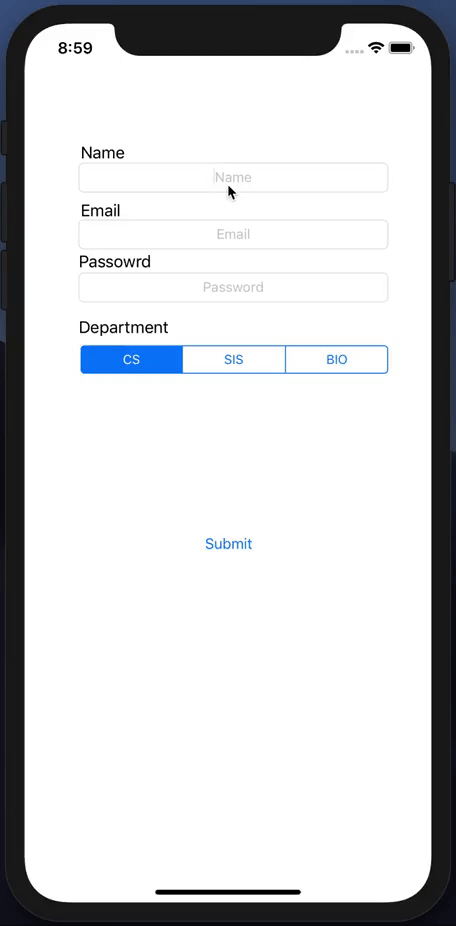
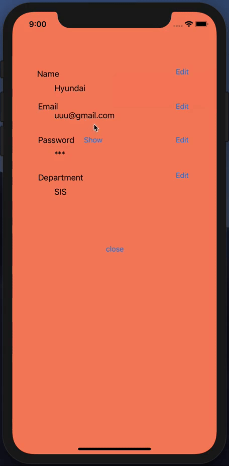
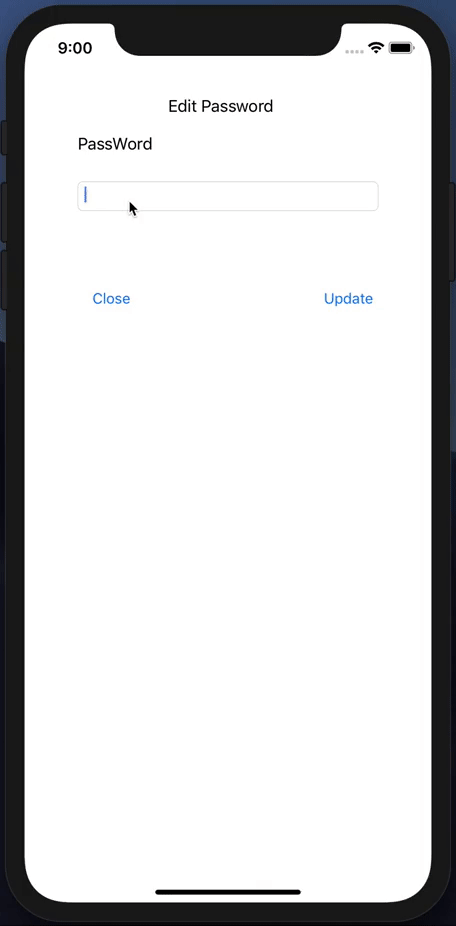

# MultiView

Multiple ViewControllers and Data Passing 
Pass data to next ViewController.
passing back data to previeous viewConroller.

# Unwind Segue
transitioning back to the presenting iew controoler.

```python
@IBAction func unwind(unwindSegue: UIStoryboardSegue) {
}
```
# Main ViewController
User enter the information.
hit SUBMIT go to next screen(viewController)


### Key code 1
https://github.com/hchung11/Swift_IOS/blob/master/MultiView/MultipleView/ViewController.swift<br>
Send data to ViewControllerSec(next ViewController)
``` python

override func prepare(for segue: UIStoryboardSegue, sender: Any?)
    {
        let goToSecView = segue.destination as! ViewControllerSec
        
        goToSecView.name = nameTextField.text
        goToSecView.email = emailTextField.text
        goToSecView.pasWord = passWordTextField.text
        goToSecView.deparmentt = departmentSwich()
        
        
    }
```

# Secound ViewController(Named: ViewControllerSec)
This viewController can edit user information.<br>


### Key code 2
https://github.com/hchung11/Swift_IOS/blob/master/MultiView/MultipleView/ViewControllerSec.swift<br>
<b>This receive fuction from edit buttons </b>
``` python
    @IBAction func unwindToVC2(unwindSegue: UIStoryboardSegue) {
        if name != "" && stringToStar() != "" && deparmentt != "" && email != ""
        {
        self.nameLabel.text = name
        self.passwordLable.text = stringToStar()
        self.departLable.text = deparmentt
        self.emailLabel.text = email
        }
    }
    
```
# How to hide the password(fucntion).
``` python
    @IBAction func showButton(_ sender: UIButton) {
        switch showHideButton.currentTitle {
        case "hide":
            self.passwordLable.text = stringToStar()
            sender.setTitle("Show", for: .normal)
        case "Show":
            
            self.passwordLable.text = pasWord
            sender.setTitle("hide", for: .normal)
        default:
            break
        }

    }
```
# Last ViewController for "Edit button"
Those Edit viewController has own.<br>
<b>Send data to Secound viewController(ViewControllerSec)</b>


### Key word
<b>Send data to secound ViewController(this is same fuction as Key code 1) </b>
``` python
    override func prepare(for segue: UIStoryboardSegue, sender: Any?){
        let goToSecView = segue.destination as! ViewControllerSec
        goToSecView.pasWord = self.editPassWordTextField.text
        
    }
``` 

