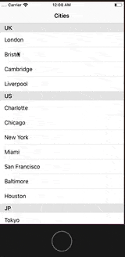
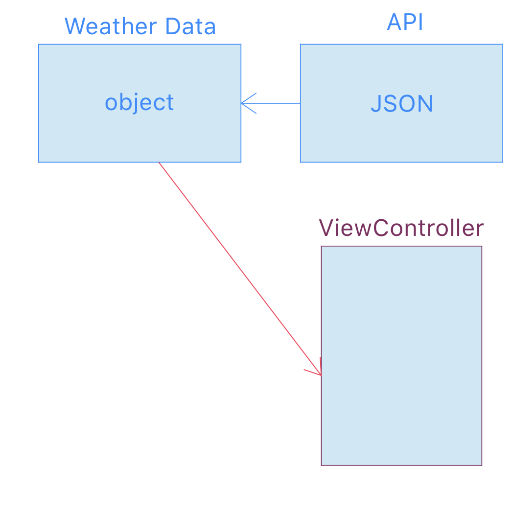

# Using OpenWeater API and JSON
<br>Download zipfiles in OpenWeatherAPI</br>
<br>[Download THIS File!!](https://github.com/hchung11/Swift_IOS/blob/master/OpenWeatherAPI/DownThisOpenWeatherAPI.zip)</br>
## Usage
```swift
import UIKit
import Alamofire
import AlamofireImage
import SwiftyJSON
```
<br>Link for **Install pod** https://guides.cocoapods.org/using/getting-started.html </br>
<br>If you haven't download **Alamfire and AlamofireImage**. This is link https://cocoapods.org/pods/Alamofire </br>

# Preview for this Application



## JSON
<br> This link is OpenWeather API Doc https://openweathermap.org/current </br>


## How data transfer API to ViewController
<br>This graphic tell where data go.</br>



