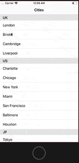
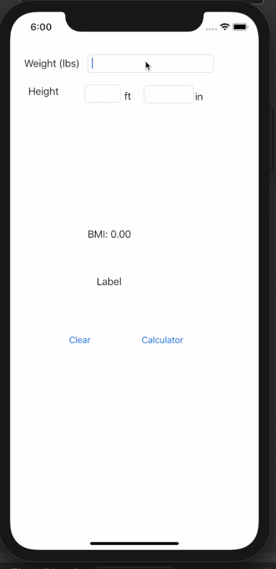

# Swift_IOS
2019 fall class mobile application development 

# Using firebase(Realtime Database)
https://github.com/hchung11/Swift_IOS/tree/master/InClass10

# OpenWetherAPI
https://github.com/hchung11/Swift_IOS/tree/master/OpenWeatherAPI

# BMI 
https://github.com/hchung11/Swift_IOS/tree/master/bmiCalculator

