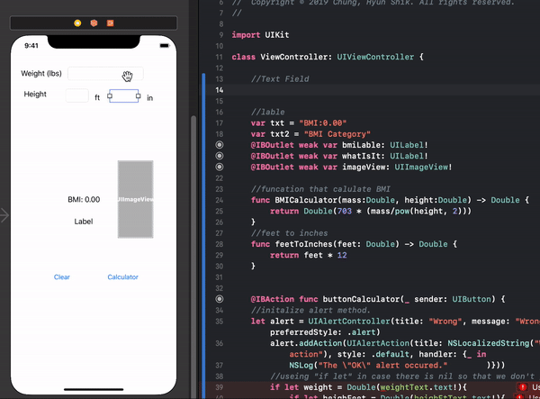

# The First Application for BMI Calculator


## Usage
``` swift
import UIKit

class ViewController: UIViewController {
}
```
## How to initialize Textfield and Label etc.. on ios

<kbd>CTRL</kbd>+<kbd>ondrag</kbd><br>



## How to make alert show up.
``` swift
//set the alert Controller
let alert = UIAlertController(title: "Wrong", message: "Wrong Key!! Enter Number!!!", preferredStyle: .alert)
//add action to the when user input worng one
    alert.addAction(UIAlertAction(title: NSLocalizedString("Wrong", comment: "Default action"), style: .default, handler: {_ in NSLog("The \"OK\" alert occured."        )}))
    
```

## Clear button
 Drog the button to the viewControl and make UIButton
 then pass all the value as empty
``` Swift
    @IBAction func clearButton(_ sender: UIButton) {
    
        weightText.text = ""
        heightInText.text = ""
        heighFtText.text = ""
        bmiLable.text = txt
        whatIsIt.text = txt2
        imageView.image = nil
    }
```
